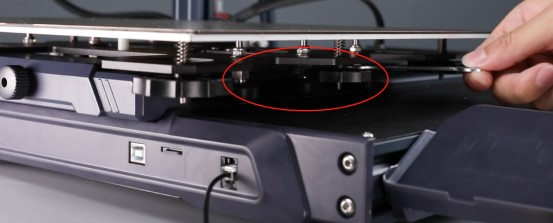
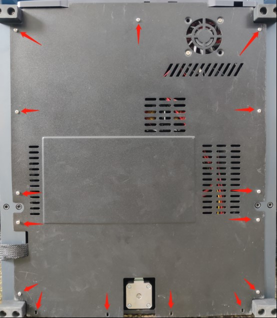
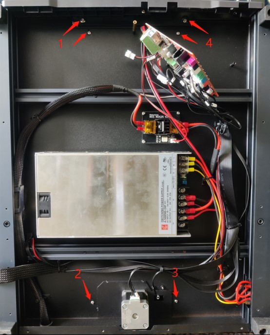
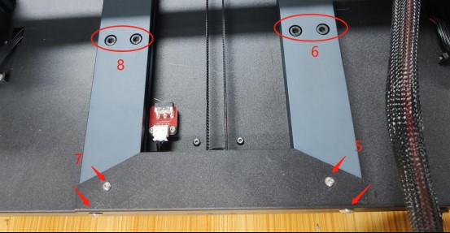
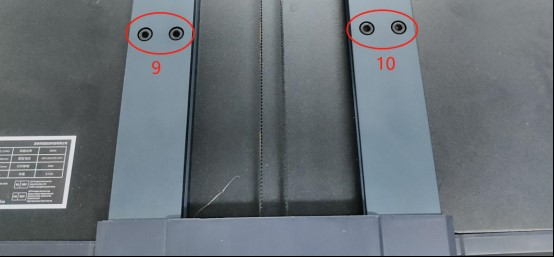
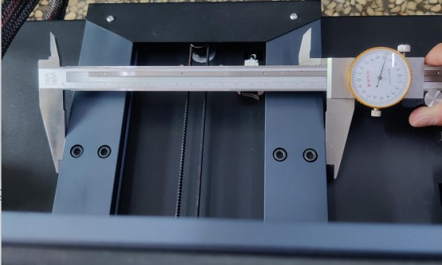
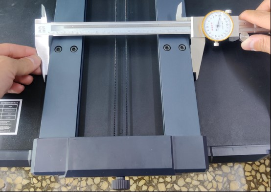

**Elegoo-Neptune-3-Plus-Y-axis-adjustment.**

Debug the parallelism of Y guide rail

Note: Please unplug the power cord before proceeding.

Steps

1. Adjust the eccentric nut of the Y-axis pulley so that each V wheel is in a loose state.

 

2. Loosen the screws of the bottom cover and remove the bottom cover.

 

​	3、Loosen the screws at 1 and 2 in the picture. If it is necessary to adjust the two profiles at the same time, you need to loosen the screws on the main board, open the main board, and loosen the screws at 4 and 3 slightly.

 Loosen the screws at positions 5, 6 and 9. If it is necessary to adjust the two profiles together, you need to slightly loosen the screws at 7, 8, and 10.

 

 

5. Use a caliper to measure the distance between the two profiles, and manually adjust the position of the profiles to ensure that the two profiles are parallel before tightening the screws in the figure.

 

 
6. After debugging, re-fix all the screws and adjust the eccentric wheels of the Y-axis pulley.